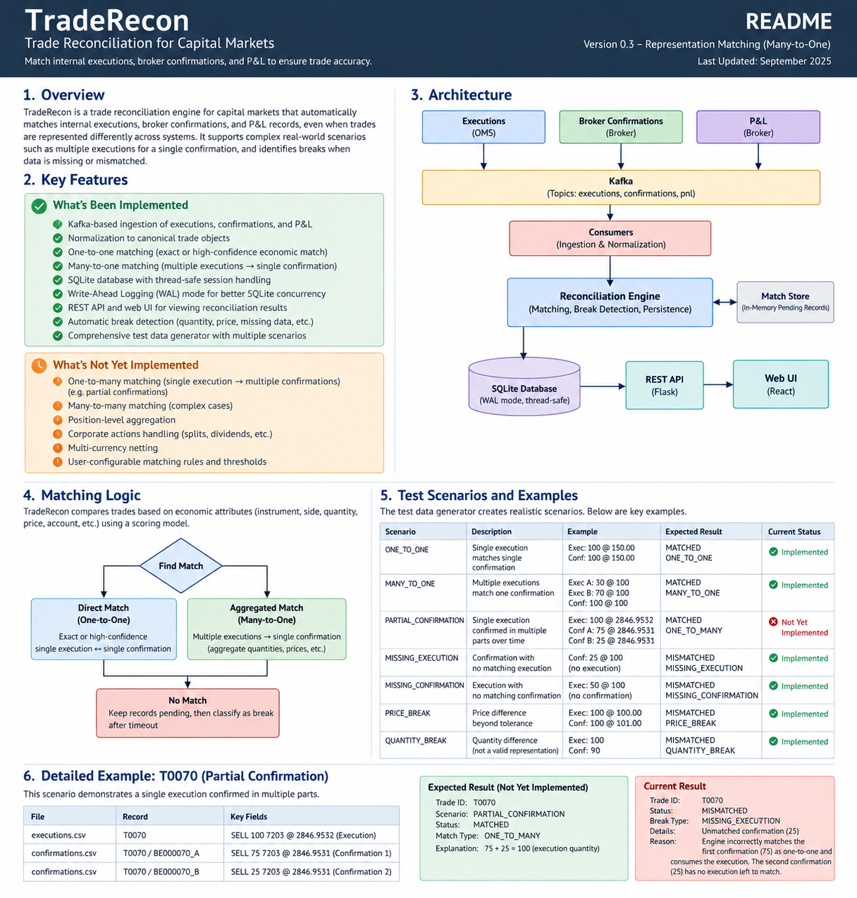

# TradeRecon (Berlin Release)

TradeRecon is a stateful post-trade reconciliation engine that compares internal executions, broker confirmations, and P&L records to identify matched trades, reconciliation breaks, missing records, and different trade representations.

The project is designed around a simple idea: **normalize records first, determine which records represent the same economic trade second, then reconcile the matched records.**

## Architecture

```text
Executions CSV ───────┐
Broker Confirmations ─┼─> Kafka ─> Consumers ─> Normalization ─> Instrument Mapping
P&L Snapshot ─────────┘                                      │
                                                            ▼
                                                     Canonical Records
                                                            │
                                                            ▼
                                                        MatchStore
                                                            │
                                          ┌─────────────────┼─────────────────┐
                                          ▼                 ▼                 ▼
                                      ONE_TO_ONE       MANY_TO_ONE       ONE_TO_MANY
                                      Implemented      Implemented       Planned
                                          │                 │                 │
                                          └─────────────────┴─────────────────┘
                                                            │
                                                            ▼
                                                   Reconciliation Engine
                                                            │
                                             Break Classification + P&L
                                                            │
                                                            ▼
                                                         SQLite
                                                            │
                                      ┌─────────────────────┼──────────────────┐
                                      ▼                     ▼                  ▼
                                  Flask UI             REST API          Prometheus/Grafana
```

## Current Features

TradeRecon currently includes Kafka-based ingestion for executions, confirmations, and P&L, canonical normalization, ticker and ISIN mapping, stateful pending-record storage, economic match scoring, one-to-one matching, many-to-one execution aggregation, VWAP calculation, late-arriving P&L enrichment, reconciliation break classification, stale-record handling, SQLite persistence, a pending-matches API, HTML reporting, Prometheus metrics, and Grafana monitoring.

The engine does not rely only on `trade_id`. Two records can still match when their identifiers differ if the economic attributes indicate that they represent the same trade.

## Normalization

Different systems may represent the same instrument differently. For example, the OMS may use `7203`, the broker may use `7203.T`, while both records share ISIN `JP3633400001`. TradeRecon maps both to the same canonical instrument before matching.

Canonical trade fields include `trade_id`, `instrument_id`, `ticker`, `side`, `quantity`, `price`, `currency`, `timestamp`, `settlement_date`, `account_id`, `source`, and the original raw record.

## Economic Matching

TradeRecon currently uses an economic match score based on instrument, side, quantity, price, timestamp, and account.

```text
Instrument = 40, Side = 10, Quantity = 20, Price = 15, Timestamp = 10, Account = 5, Maximum = 100
```

The default matching threshold is `80`.

This allows economically related trades with different identifiers to match, but it also creates an important edge case: a trade with the wrong quantity can still score exactly `80` if all other fields agree. Because of this, grouped matching must be evaluated carefully before consuming a partial execution or partial confirmation.

## One-to-One Matching

This is fully implemented.

Example: execution `T0001, BUY AAPL, 100 @ 190.00`, confirmation `T0001, BUY AAPL, 100 @ 190.00`.

Expected result: `ONE_TO_ONE, MATCHED`.

If the records belong together but one field differs, TradeRecon still associates them and records a reconciliation break. Example: execution settlement date `2026-09-14`, confirmation settlement date `2026-09-15`, expected result `ONE_TO_ONE, MISMATCHED, SETTLEMENT_BREAK`.

## Many-to-One Matching

Many-to-one matching is implemented and continues to be refined.

Example: execution `T0032_A, BUY AAPL, 150 shares`, execution `T0032_B, BUY AAPL, 50 shares`, broker confirmation `BRK_T0032, BUY AAPL, 200 shares`.

Expected result: `T0032_A + T0032_B = 200`, match type `MANY_TO_ONE`, status `MATCHED`.

The executions are aggregated before reconciliation. Quantity is summed and price is calculated using VWAP:

```text
VWAP = Σ(price × quantity) / Σ(quantity)
```

A synthetic reconciliation ID may look like `T0032_A+T0032_B`.

### Known Many-to-One Issue

Earlier logic tried direct matching before grouped matching. Because a partial execution could still score `80`, TradeRecon could incorrectly accept `T0074_A` as `ONE_TO_ONE, QUANTITY_BREAK` before checking whether `T0074_A + T0074_B` matched the broker confirmation.

The expected behavior is to compare both representations and prefer the stronger economic explanation. For example, direct match score `80`, aggregated match score `100`, therefore choose `MANY_TO_ONE`.

## Partial Confirmation / One-to-Many

This is **not yet implemented**.

`PARTIAL_CONFIRMATION` is the test-generator scenario name for a single internal execution confirmed by the broker in multiple pieces. The final intended match type is `ONE_TO_MANY`.

Example:

```text
Execution: T0070, SELL 7203, 100 @ 2846.9532
Confirmation A: T0070 / BE000070_A, 75 @ 2846.9531
Confirmation B: T0070 / BE000070_B, 25 @ 2846.9531
```

Economically, `75 + 25 = 100`, so the expected result is `T0070, PARTIAL_CONFIRMATION, MATCHED`, with match type `ONE_TO_MANY`.

The current engine does not yet aggregate broker confirmations. It may match the first 75-share confirmation against the 100-share execution, record a quantity mismatch, remove the execution, then later treat the remaining 25-share confirmation as `MISSING_EXECUTION`.

Current incorrect result may therefore look like:

```text
T0070, MISMATCHED, MISSING_EXECUTION, UNMATCHED_CONFIRMATION, confirmation quantity = 25
```

The expected future behavior is:

```text
First confirmation arrives: expected 100, confirmed 75, remaining 25, status PENDING_PARTIAL
Second confirmation arrives: 75 + 25 = 100, aggregate confirmations, ONE_TO_MANY, MATCHED
```

## Many-to-Many

Many-to-many matching is not implemented.

Example: internal executions `50 + 150`, broker confirmations `75 + 125`, both sides total `200`.

Expected future result: `MANY_TO_MANY, MATCHED`.

This will require grouping and aggregation on both sides before reconciliation.

## Duplicate Confirmation Handling

Duplicate or replay protection is not fully implemented.

For example, receiving the same `broker_execution_id = BE123` twice should be treated as a duplicate message, not as two separate 100-share fills. However, distinct broker executions such as `BE000070_A` and `BE000070_B` may legitimately represent separate partial confirmations.

A future idempotency layer should track source identifiers such as `execution_id`, `broker_execution_id`, or another unique message key.

## Reconciliation Checks

Once records are economically matched, TradeRecon compares instrument, quantity, price, side, timestamp, currency, settlement date, and P&L.

Current break types include `INSTRUMENT_BREAK`, `QUANTITY_BREAK`, `PRICE_BREAK`, `SIDE_BREAK`, `TIMESTAMP_BREAK`, `CURRENCY_BREAK`, `SETTLEMENT_BREAK`, `PNL_BREAK`, `MISSING_EXECUTION`, `MISSING_CONFIRMATION`, `MULTIPLE_BREAKS`, and `OTHER_BREAK`.

Matching tolerance and reconciliation tolerance are intentionally different. For example, two records may be close enough in timestamp to determine that they represent the same trade, but still exceed the stricter reconciliation threshold and become `TIMESTAMP_BREAK`.

## Pending and Stale Records

Incoming records are stored in `MatchStore` before they are finalized.

Typical lifecycle:

```text
PENDING -> MATCHED
PENDING -> MISMATCHED
PENDING -> MISSING_EXECUTION
PENDING -> MISSING_CONFIRMATION
```

Current development defaults are `MATCH_TIMEOUT_SECONDS = 30` and `STALE_SWEEP_INTERVAL_SECONDS = 5`.

The API endpoint `/api/pending_matches` exposes records that are still waiting for a counterpart.

Future partial-confirmation support should add a state such as `PENDING_PARTIAL`, for example `expected quantity = 100, confirmed quantity = 75, remaining quantity = 25`.

## P&L

P&L records can arrive after the execution and confirmation have already matched. TradeRecon retains completed-match aliases so later P&L can still be associated with the trade.

P&L consistency is approximately:

```text
realized_pnl + unrealized_pnl + fx_pnl - total_fees ≈ net_pnl
```

## SQLite and Threading

TradeRecon runs multiple consumer and application threads. The earlier version reused a long-lived SQLAlchemy session, which caused errors such as:

```text
SQLite objects created in a thread can only be used in that same thread
```

The Berlin version uses thread-compatible SQLite settings, fresh SQLAlchemy sessions for database operations, a database write lock, and optionally WAL mode.

Recommended configuration:

```python
create_engine(
    db_url,
    connect_args={"check_same_thread": False},
    pool_pre_ping=True
)
```

Recommended SQLite pragmas:

```text
PRAGMA journal_mode=WAL
PRAGMA busy_timeout=5000
```

## Reporting and UI

The current UI shows matched, mismatched, grouped, and pending records, with fields such as trade ID, ticker, status, break type, match type, component IDs, execution quantity, confirmation quantity, prices, timestamps, net P&L, commission, and mismatch details.

The UI can only display what the backend persisted. It cannot reconstruct a correct grouped relationship after the matching engine has already saved an incorrect `ONE_TO_ONE` result.

For this reason, match classification belongs in the matching engine, not the report layer.

## Test Scenarios

| Scenario             | Example                                        | Expected                  | Current Status         |
| -------------------- | ---------------------------------------------- | ------------------------- | ---------------------- |
| ONE_TO_ONE           | Execution 100, Confirmation 100                | `MATCHED, ONE_TO_ONE`     | Implemented            |
| PRICE_BREAK          | Execution 100 @ 190, Confirmation 100 @ 190.25 | `MISMATCHED, PRICE_BREAK` | Implemented            |
| TICKER_MAPPING       | `7203` vs `7203.T`, same ISIN                  | Same instrument           | Implemented            |
| MANY_TO_ONE          | Executions 150 + 50, Confirmation 200          | `MATCHED, MANY_TO_ONE`    | Implemented / refining |
| PARTIAL_CONFIRMATION | Execution 100, Confirmations 75 + 25           | `MATCHED, ONE_TO_MANY`    | Not implemented        |
| MANY_TO_MANY         | Executions 50 + 150, Confirmations 75 + 125    | `MATCHED, MANY_TO_MANY`   | Not implemented        |
| MISSING_EXECUTION    | Confirmation exists, execution absent          | `MISSING_EXECUTION`       | Implemented            |
| MISSING_CONFIRMATION | Execution exists, confirmation absent          | `MISSING_CONFIRMATION`    | Implemented            |

## Expected Results vs Current Results

`expected_results.csv` represents the intended economic truth, not necessarily the behavior already implemented by the engine.

For example:

```text
T0070,PARTIAL_CONFIRMATION,MATCHED
```

means the correct economic result should eventually be a matched one-to-many relationship. If the current system instead produces `MISSING_EXECUTION`, that is a known feature gap rather than an error in the expected test data.

This makes the test generator useful for both regression testing and roadmap development:

```text
expected_results.csv = target behavior, reconciliation database = current behavior, difference = regression or missing feature
```

## Current Status

Implemented: Kafka ingestion, canonical normalization, instrument mapping, MatchStore, one-to-one matching, many-to-one aggregation, VWAP, late P&L, stale-record handling, break classification, SQLite persistence, pending API, HTML reporting, Prometheus, and Grafana.

Partially implemented or being refined: many-to-one candidate selection, grouped-match persistence, duplicate handling, and concurrent SQLite behavior.

Not yet implemented: one-to-many confirmation aggregation, `PENDING_PARTIAL`, many-to-many matching, full idempotency/replay protection, and explicit persisted `match_type`.

## Next Development Priorities

1. Prevent quantity-mismatched partial records from being consumed as direct one-to-one matches.
2. Add broker-confirmation aggregation.
3. Implement `ONE_TO_MANY`.
4. Add `PENDING_PARTIAL`.
5. Persist `match_type` directly in the database.
6. Add duplicate/replay detection.
7. Extend grouped matching to `MANY_TO_MANY`.

The long-term objective is not simply to maximize the number of green rows. The objective is to reconstruct the correct economic trade representation first, then classify only genuine reconciliation breaks.


